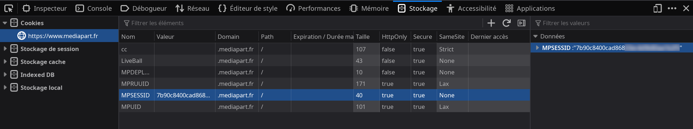

edwypub - convertir un article de Mediapart au format EPUB
=

edwypub permet de convertir un article du site d'actualité
[Mediapart](https://www.mediapart.fr)
en un livre électronique au format
[EPUB](https://www.w3.org/TR/epub-overview-33/).

Installation
-

edwypub est écrit en Python et dépend des modules externes suivants :

* [beautifulsoup4](https://pypi.org/project/beautifulsoup4/)
* [ebooklib](https://pypi.org/project/EbookLib/)
* [requests](https://pypi.org/project/requests/)

Le programme peut s'installer dans un
[environnement virtuel](https://docs.python.org/3.12/library/venv.html)
comme suit:

    $ python3 -m venv /path/to/venv
    $ source /path/to/venv/bin/activate
    $ git clone https://github.com/cvubrugier/edwypub.git
    $ cd edwypub
    $ pip install .

Utilisation
-

Le programme a besoin de connaître la valeur du cookie
`MPSESSID`. Cette valeur peut être obtenue en se connectant au site de
Mediapart avec un navigateur Web puis en activant les outils de
développement (raccourcis `Ctrl+Maj+i` ou `F12`).

Il faut sélectionner l'onglet _Stockage_ puis l'élément _Cookies_.

La valeur du cookie `MPSESSID` est transmise au programme via
l'argument `--session`. Suivent les URLs des articles à convertir au
format EPUB.

    $ edwypub --session $MPSESSID https://www.mediapart.fr/rubrique/un-article-a-convertir

Bonne lecture !

Licence
-

edwypub est publié sous licence [MIT](https://spdx.org/licenses/MIT.html).
